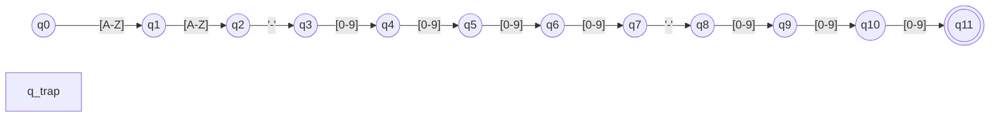

# Product Code Validator — What's your DFA
> **COM243**  

A native inventory manager and interactive DFA simulator built with Python, NiceGUI, and MySQL. It validates structured product serial codes against a minimized Deterministic Finite Automaton (DFA) before interacting with the database.

---

## 1. Formal Automata Specification

The target language $L$ validates product serial codes categorized by hardware domain:

* **Format:** `[A-Z]² - [0-9]⁴ - [0-9]³` *(e.g., `IT-2026-001`)*
* **Regular Expression:** `([A-Z]{2})-([0-9]{4})-([0-9]{3})`

### 5-Tuple Definition: M = (Q, Σ, δ, q₀, F)

* **States ($Q$):** $\{q_0, q_1, q_2, \dots, q_{11}, q_{\text{trap}}\}$
* **Alphabet ($\Sigma$):** $\{A\dots Z\} \cup \{0\dots 9\} \cup \{'-'\} \quad (\vert{}\Sigma\vert{} = 37)$
* **Start State:** $q_0$
* **Accepting / Final State ($F$):** $\{q_{11}\}$
* **Transition Function ($\delta$):** Static dictionary mapping $(q_i, \sigma) \to q_{i+1}$. Any illegal symbol or unexpected token diverts immediately to $q_{\text{trap}}$.


> **Note:** Any invalid symbol $\sigma \notin \Sigma$ or unexpected transition immediately diverts execution to `q_trap`.

### Domain Prefix Mapping

| Prefix | Category | Example Assets |
| :---: | :--- | :--- |
| `IT` | IT Equipment | Laptops, Rack Servers, Workstations |
| `EL` | Electronics | Power Supplies, Microcontrollers, Sensors |
| `PR` | Peripherals | Mechanical Keyboards, Mice, Monitors |
| `NW` | Networking | Routers, Switches, Patch Panels |
| `OF` | Office Hardware | Standing Desks, Ergonomic Chairs |

---

## 2. Course Compliance Matrix (COM243)

| # | Requirement | Implementation Detail |
| :-: | :--- | :--- |
| **1** | Input Specification | Monospace text entry supporting structured alphanumeric tokens |
| **2** | Alphabet Validation | Validates against $\Sigma$; illegal characters route directly to $q_{\text{trap}}$ |
| **3** | Symbol Processing | Iterates symbol-by-symbol using dictionary lookups without regex shortcuts |
| **4** | State Trace Display | Step-by-step ticker tape displaying $[c]: [q_i] \to [q_{i+1}]$ |
| **5** | Final State Identification | Reports halting at accepting state $q_{11}$ or non-accepting $q_{\text{trap}}$ |
| **6** | Decision Output | High-contrast visual verdicts (Emerald ACCEPT / Rose REJECT) |
| **7** | Persistence & Logging | Saves execution traces and timestamps to MySQL `validation_logs` |

---

## 3. Installation & Setup

### Database Setup
Ensure MySQL/MariaDB is running on port `3306`, then import `schema.sql`:

* **Windows (UniServer Zero XIII):**  
  Start MySQL, open phpMyAdmin, create `automata_validator`, and import `schema.sql`.

* **Linux (Ubuntu / Debian — Native MariaDB):**
  ```bash
  sudo apt update && sudo apt install -y mariadb-server
  sudo systemctl start mariadb
  sudo mysql -u root -p -e "CREATE DATABASE IF NOT EXISTS automata_validator;"
  sudo mysql -u root -p automata_validator < schema.sql
  ```

* **Linux Optional (Standalone phpMyAdmin via PHP CLI — No Apache):**  
  To view tables in the browser without installing or configuring Apache:
  ```bash
  sudo apt install -y phpmyadmin php-cli php-mbstring php-mysqli
  php -S 127.0.0.1:8080 -t /usr/share/phpmyadmin
  ```
  *Open `http://127.0.0.1:8080` and log in with your MySQL/MariaDB credentials.*

### Application Setup
```bash
# 1. Clone & enter repository
git clone https://github.com/uno-jerome/Product-Validator.git
cd Product-Validator

# 2. Setup virtual environment
python -m venv .venv
# Windows: .venv\Scripts\activate | Linux: source .venv/bin/activate

# 3. Install dependencies
pip install -r requirements.txt
```

---

## 4. Execution & Usage

### Launch Desktop Dashboard
```bash
python main.py
```
*Access via native window, or open `http://127.0.0.1:8000` in your browser.*

### Run Automated Tests
```bash
pytest tests/test_dfa.py -v
```

### Application Tabs
* **Scanner & Lookup:** Test arbitrary serial strings or use the preset error buttons (`Valid Code`, `Prefix Error`, `Year Error`, etc.) to trace state transitions symbol-by-symbol.
* **Register Product:** Fill in inventory fields with a real-time hardware tag preview. The generated serial is verified by the DFA engine prior to database insertion.
* **Inventory Catalog:** Browse and filter persistent records, or click **Scan** to transfer an item back into the state visualizer.